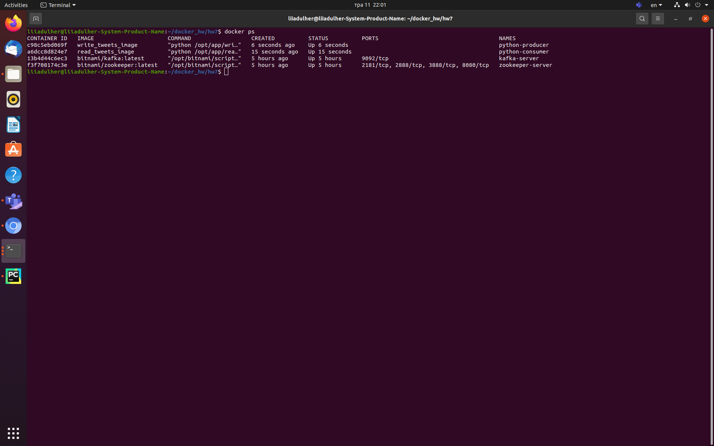
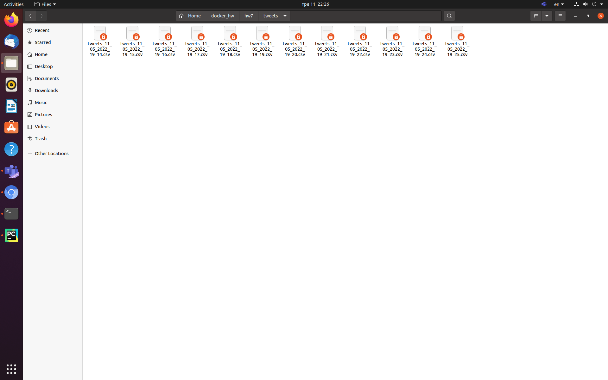
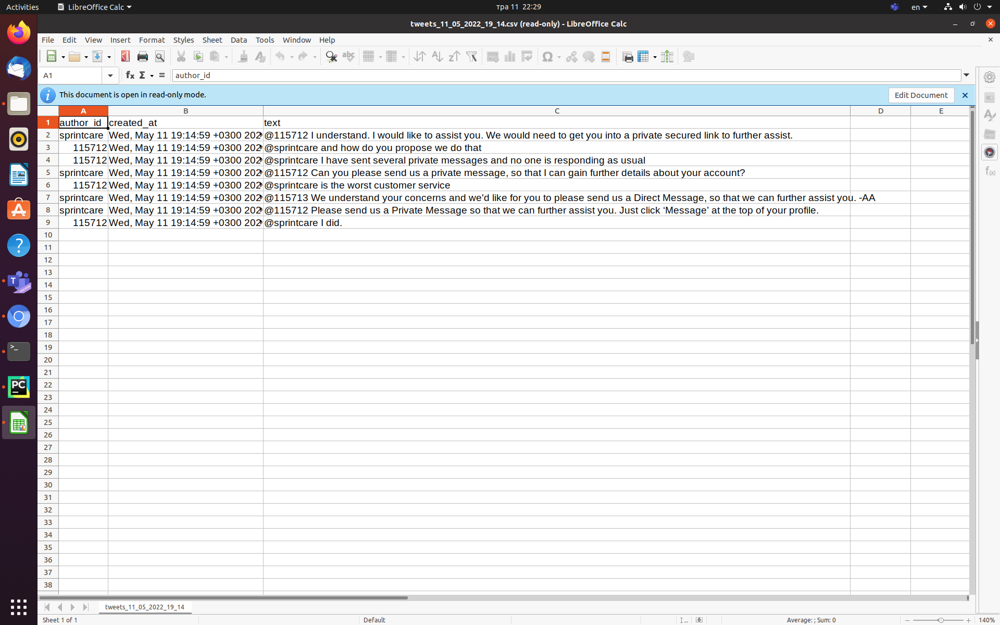

# Docker hw7
Kafka 3

## Team: [Liia_Dulher](https://github.com/LiiaDulher)

### Prerequiments
Please put file <b>twcs.csv</b> in this directory.<br>
Create sub-directory <b>tweets</b> in this directory. It must be <b>EMPTY</b>.

### Usage
````
$ sudo chmod +x run-cluster.sh
$ sudo chmod +x shutdown-cluster.sh
$ sudo chmod +x python-producer.sh
$ sudo chmod +x python-consumer.sh
````
Run <i>python-producer.sh</i> and <i>python-consumer.sh</i> in differnt terminal windows.
````
$ ./run-cluster.sh
$ ./python-producer.sh
$ ./python-consumer.sh
$ ./shutdown-cluster.sh
````

### Results



